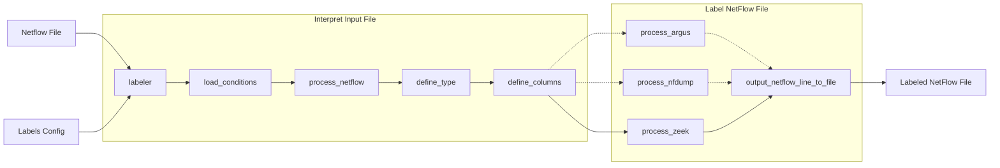

# NetflowLabeler
[](https://github.com/stratosphereips/netflowlabeler/actions/workflows/docker-image.yml)


Author: Sebastian Garcia, eldraco@gmail.com, sebastian.garcia@agents.fel.cvut.cz and Veronica Valeros valerver@fel.cvut.cz.

NetflowLabeler is a Python tool to add labels to netflow text files. If you have a netflow text file and you want to add labels to it, you can add the labels and conditions to a configuration file and use this tool to assign them.

The labels are assigned by following our own label ontology. The ontology is designed as configuration file that you can modify. You can add a generic labels and a detailed labels.

For now it works only in for Zeek files separated by TABS. In the future it will include Zeek with JSON and CSV, Argus with CSV and TABS, Nfdump with CSV and Suricata with JSON


__netflowlabeler.py__ can label conn.log files based on a configuration file. __zeek-files-labeler.py__ can label the rest of the Zeek log files, using the labels in the conn.log file.


# Usage for labeling a conn.log file

    netflowlabeler.py -c <configFile> [-v <verbose>] [-d DEBUG] -f <netflowFile> [-h]

# Usage for using the labels in a conn.log file to label the rest of the Zeek files

    zeek-files-labeler.py -l conn.log.labeled -f folder-with-zeek-log-files

# Features

- You can have AND and OR conditions
- You can have generic labels and detailed labels
- You can use negative conditions
- All columns that can be interpreted as numbers can be compared with <, >, <= and >=
- You can add comments in any place
- You can use CIDR notation for IP ranges
- You can label all the Zeek log files, by using the labels you put in the conn.log file

# Example Configuration File of Labels

The conf file syntax is like this:

    Background:
        - srcIP=all
    # Here the generic label is Background and the detailed label is ARP
    Background, ARP: 
        - Proto=ARP
    Malicious, From_Malware:
        - srcIP=10.0.0.34
    Malicious-More, From_Other_Malware:
        - srcIP!=10.0.0.34 & dstPort=23
    Malicious-HEre, From_This_Malware:
        - srcIP=10.0.0.34 & State=SF
    Malicious, From_Local_Link_IPv6:
        - srcIP=fe80::1dfe:6c38:93c9:c808
    Test-State:
        - srcIP=10.0.0.34 & State=S0
    Test-largebytes:
       - Bytes>=100
    Test-smallbytes:
       - Bytes<=100
    Benign, FromWindows:
        - Proto=UDP & srcIP=147.32.84.165 & dstPort=53     # (AND conditions go in one line)
        - Proto=TCP & dstIP=1.1.1.1 & dstPort=53           # (all new lines are OR conditions)

0. The first part of the label is the generic label (Benign), after the comma is the detailed description (FromWindows). We encourage not to use : or spaces or , or TABs in the detailed description
1. If there is no |, then the detailed label is empty. 
2. Don't use quotes for the text.
3. Labels are assigned from top to bottom
4. Each new label superseeds and overwrites the previous match

The position is the priority of the rule. First we check the first rule matches and if it does, then we assign that label. Then we check the second rule, etc.


These are the possible fields that you can use in a configuration file to create the rules used for labeling.

- Date
- start
- Duration
- Proto
- srcIP
- srcPort
- dstIP
- dstPort
- State
- Tos
- Packets
- Bytes
- Flows

The fields 'Bytes', 'Packets' and 'IPBytes' are computed in Zeek from the fields for the src and dst values. For example, Bytes=srcbytes + dstbytes

# Docker Image

Netflow labeler has a public docker image with the latest version. 

To test the labeler is working correctly, run the following command. The command will run the netflow labeler tool on a Zeek example conn.log file and then cat the labeled file to the standard output. You should see the fresh labels in the output (e.g.: search for the string 'Test-smallbytes').

```bash
docker run --tty -it stratosphereips/netflowlabeler:latest /bin/bash -c 'python3 netflowlabeler.py -c labels.config  -f examples/conn.tab.log ; cat examples/conn.tab.log.labeled'
```

To mount your logs path to the container and run the netflow labeler interactively:
```bash
docker run -v /full/path/to/logs/:/netflowlabeler/data --rm -it stratosphereips/netflowlabeler:latest /bin/bash
```

To mount your logs path to the container and automatically run the netflow labeler on it with your own labels.config file:
```bash
docker run -v /full/path/to/logs/:/netflowlabeler/data --rm -it stratosphereips/netflowlabeler:latest python3 netflowlabeler.py -c data/labels.config -f data/conn.log
```

# Netflow Labeler High Level Diagram


